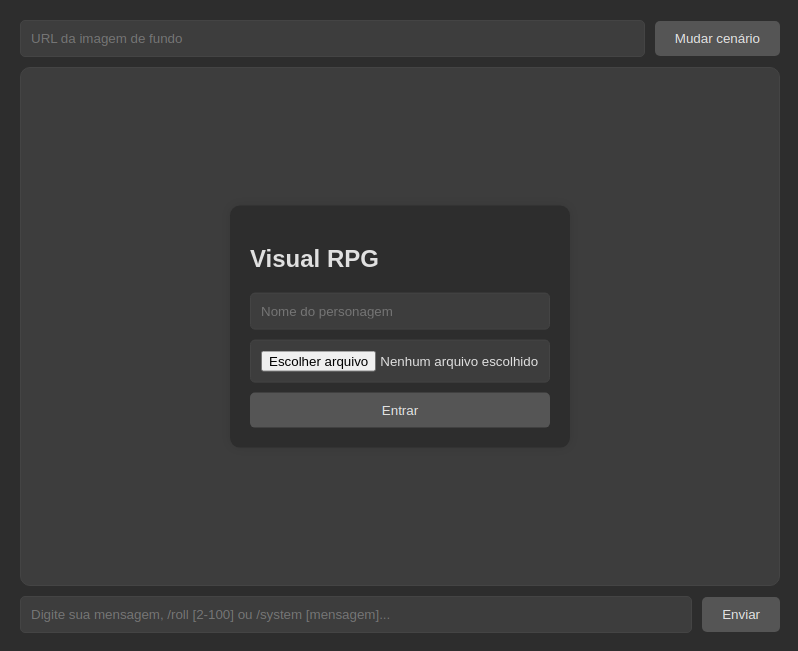

# visual-rpg
Chat em desenvolvimento para jogar RPGs baseados em texto.



## Instalação e inicialização
1. Abra um terminal e cole os seguintes comandos:
```
git clone https://github.com/proxlu/visual-rpg.git
cd visual-rpg
npm install
node server.js
```
2. Depois acesse o endereço http://localhost:3000

visual-rpg - by: proxlu
